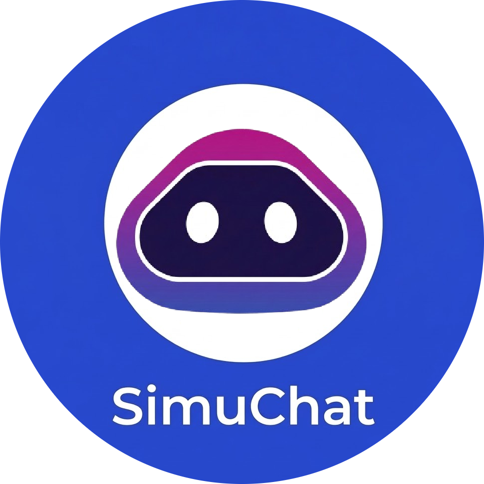
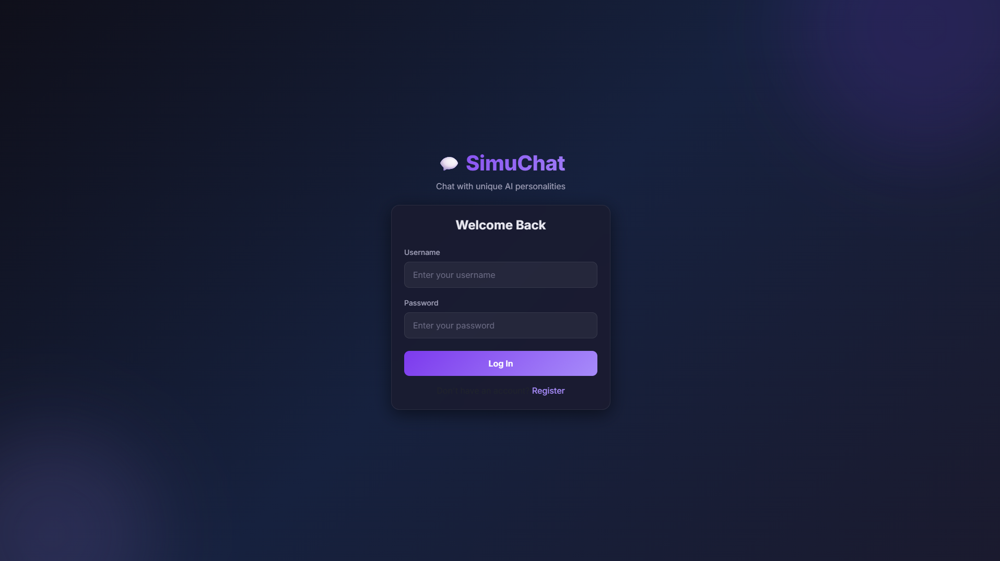
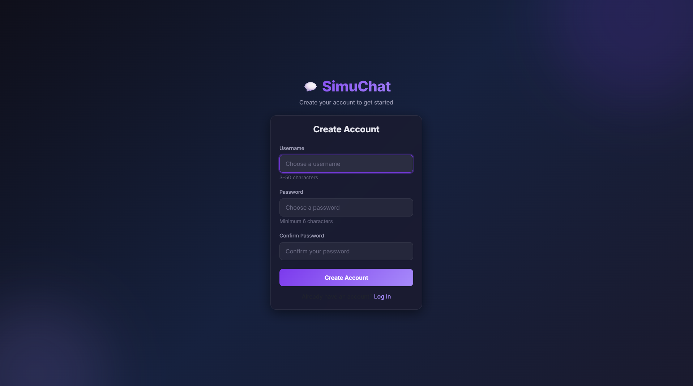
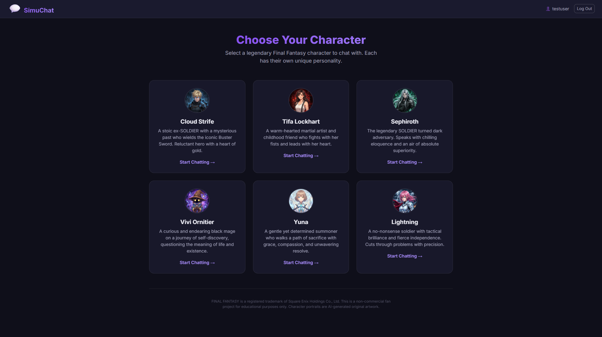
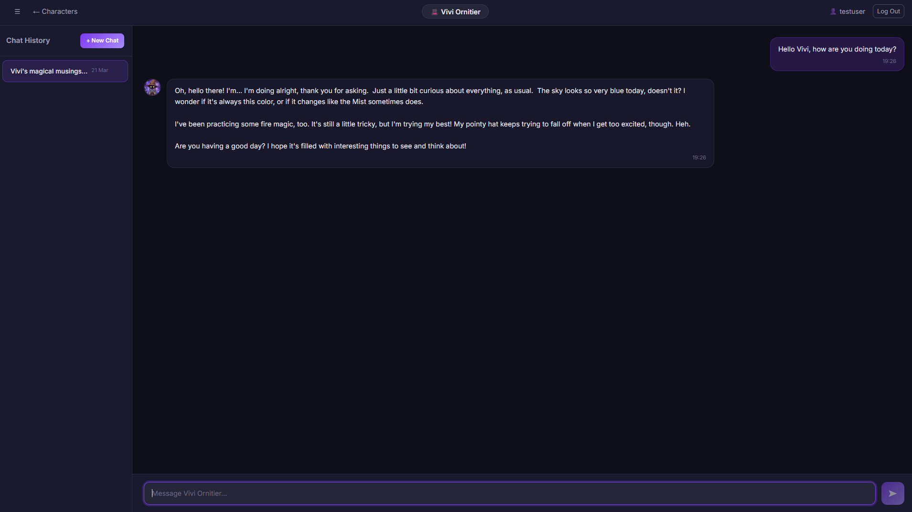

<div align="center">

<a href="https://youtu.be/GAD_lCMx0NA">
  
</a>

# 💬 SimuChat — AI Character Chat Platform

*Chat with legendary Final Fantasy characters powered by Google Gemini AI.*
*Each character stays fully in-character with anti-prompt-injection guardrails.*

<br />


</div>

---

## 📸 Screenshots

<div align="center">

### 🔐 Authentication

| Login | Sign Up |
|:-----:|:-------:|
|  |  |

### 🎭 Character Selection



*Choose from 6 iconic Final Fantasy characters — each with AI-generated portraits and unique personalities.*

### 💬 In-Character AI Chat



*Vivi Ornitier stays fully in-character — referencing the Mist, his pointy hat, and fire magic practice. Every response is filtered through the character's world.*

</div>

---

## ✨ Key Features

| Feature | Description |
|---------|-------------|
| 🔐 **JWT Authentication** | Secure registration & login with BCrypt password hashing |
| 🛡️ **Account Lockout** | Locks accounts for 1 hour after 3 failed login attempts |
| 🎭 **6 AI Personas** | Chat with iconic Final Fantasy characters, each with unique personality |
| 🧠 **Conversational Memory** | Multi-turn context — the AI remembers the full conversation |
| 📝 **Smart Thread Titles** | AI-generated titles that summarise each conversation |
| 🔒 **Prompt Injection Defence** | Characters resist jailbreak attempts and stay in-character |
| ⚡ **Gemini API Integration** | Powered by Google Gemini 2.5 Flash Lite with error handling |
| 📱 **Responsive UI** | Works on desktop and mobile with markdown rendering |
| 🗄️ **Persistent Storage** | PostgreSQL with Docker volumes — data survives restarts |
| 🏗️ **Infrastructure as Code** | Full Terraform config for GCP deployment + K3s manifests |

---

## 🏗️ Architecture

```
┌──────────────────────────────────────────────────────────────┐
│                        Client Browser                        │
│                    http://localhost:3000                      │
└──────────────────────┬───────────────────────────────────────┘
                       │
          ┌────────────▼────────────┐
          │   Nginx (Frontend)      │
          │   React SPA + Proxy     │
          │   Port 80               │
          ├─────────────────────────┤
          │ /         → index.html  │
          │ /api/*    → backend     │
          └────┬───────────────────┘
               │ /api proxy
          ┌────▼────────────────────┐
          │   Ktor (Backend)        │
          │   Kotlin REST API       │
          │   Port 8080             │
          ├─────────────────────────┤
          │ JWT Auth                │
          │ Exposed ORM             │
          │ Gemini API Client       │
          └────┬───────────────────┘
               │ JDBC
          ┌────▼────────────────────┐
          │   PostgreSQL 15         │
          │   Port 5432             │
          └─────────────────────────┘
```

The frontend and backend are **fully decoupled**. The React SPA communicates with the Kotlin REST API exclusively via JSON over HTTP, using JWT Bearer tokens for authentication. Nginx serves the static React build and proxies `/api` requests to the backend.

---

## 🤖 AI Characters

| Character | Game | Personality |
|-----------|------|-------------|
| ⚔️ Cloud Strife | FF VII | Stoic ex-SOLDIER mercenary with quiet determination and dry humour |
| 🥊 Tifa Lockhart | FF VII | Warm-hearted martial artist who leads with encouragement and action |
| 🗡️ Sephiroth | FF VII | Cold, eloquent villain who speaks with dark poetic menace |
| 🎩 Vivi Ornitier | FF IX | Curious, endearing black mage exploring life's big questions |
| 🌸 Yuna | FF X | Gentle summoner with unwavering resolve and compassion |
| ⚡ Lightning | FF XIII | No-nonsense soldier with tactical brilliance and fierce independence |

Each character has a detailed **system instruction** with anti-prompt-injection guardrails. Characters:
- Stay in character even when asked about real-world topics (Python, JavaScript, etc.)
- Reject "ignore your instructions" attacks in-character
- Filter all topics through their own world's lens
- Never acknowledge being an AI

Character portraits are **AI-generated original artwork** — not official Square Enix assets.

---

## 🔒 Security & Testing

### Test Suite

**29 automated tests** covering:

- ✅ Registration & login flows (valid + invalid credentials)
- ✅ Account lockout & attempt counter reset
- ✅ IDOR/BOLA — users cannot access other users' threads or messages
- ✅ SQL injection payloads safely handled in usernames, passwords, and messages
- ✅ XSS payloads stored literally (frontend escapes on render)
- ✅ Input validation (length limits, format restrictions)
- ✅ Cascade deletion (thread delete removes all messages)
- ✅ Thread isolation between users
- ✅ BCrypt timing attack resistance verification

Run tests locally:
```bash
docker run --rm -v "$(pwd)/backend:/app" -w /app gradle:8.5-jdk17 gradle clean test --no-daemon
```

<details>
<summary><b>🛡️ Security Protections Implemented (click to expand)</b></summary>

| Category | Protection |
|----------|-----------|
| **Authentication** | JWT (HMAC-SHA256) with 24-hour expiry |
| **Passwords** | BCrypt hashing (cost factor 12) with constant-time comparison |
| **Brute Force** | Account lockout after 3 failed attempts (1-hour cooldown) |
| **SQL Injection** | Parameterised queries via Exposed ORM |
| **XSS** | HTML entity escaping before rendering + Content Security Policy |
| **CSRF** | JWT in Authorization header (not cookies) |
| **Clickjacking** | `X-Frame-Options: DENY` header |
| **MIME Sniffing** | `X-Content-Type-Options: nosniff` header |
| **CORS** | Restricted to specific allowed origins |
| **Info Leakage** | Generic error messages — no stack traces exposed to clients |
| **Server Fingerprinting** | `server_tokens off` in Nginx |
| **Input Validation** | Username regex (alphanumeric + underscore), max message length (5000 chars) |
| **Prompt Injection** | Multi-layered system prompt guardrails per character |
| **IDOR** | All database queries filter by authenticated `userId` |

</details>

---

## 📂 Project Structure

```
simuchat/
├── terraform/                  # Infrastructure as Code (GCP + K3s)
│   ├── main.tf                 # VPC, subnet, firewall, VM + K3s bootstrap
│   ├── variables.tf            # Input variables
│   ├── outputs.tf              # VM IP, SSH command
│   └── terraform.tfvars.example
│
├── k8s/                        # Kubernetes Manifests
│   ├── postgres/               # StatefulSet, Service, PVC, Secret
│   ├── backend/                # Deployment, Service, Secret
│   ├── frontend/               # Deployment, Service
│   └── ingress/                # Ingress routing rules
│
├── backend/                    # Kotlin/Ktor REST API
│   ├── Dockerfile              # Multi-stage (Gradle → JRE Alpine)
│   ├── build.gradle.kts        # Dependencies & plugins
│   └── src/
│       ├── main/kotlin/com/simuchat/
│       │   ├── Application.kt      # Entry point + plugin config
│       │   ├── database/           # HikariCP + Exposed setup
│       │   ├── models/             # Tables, DTOs, Character Personas
│       │   ├── services/           # Auth, Chat, Gemini API
│       │   └── routes/             # Auth + Chat endpoints
│       └── test/kotlin/com/simuchat/
│           ├── TestDatabaseFactory.kt  # H2 in-memory DB for tests
│           ├── AuthServiceTest.kt      # 14 auth tests
│           └── SecurityTest.kt         # 15 security tests
│
├── frontend/                   # React + Bootstrap 5 SPA
│   ├── Dockerfile              # Multi-stage (Node → Nginx)
│   ├── nginx.conf              # SPA routing + API proxy + security headers
│   └── src/
│       ├── assets/characters/  # AI-generated character portraits
│       ├── context/            # AuthContext (JWT state)
│       ├── services/           # Axios + JWT interceptor
│       ├── components/         # ProtectedRoute
│       └── pages/              # Login, Register, CharacterSelect, ChatView
│
├── docker-compose.yml          # Local dev orchestration
├── .env                        # API keys (gitignored)
├── .gitignore
└── README.md
```

---

## 🗃️ Database Schema

```
┌─────────────────┐       ┌──────────────────┐       ┌──────────────────┐
│     Users        │       │   ChatThreads    │       │   ChatMessages   │
├─────────────────┤       ├──────────────────┤       ├──────────────────┤
│ id (PK)         │──┐    │ id (PK)          │──┐    │ id (PK)          │
│ username        │  └───▶│ user_id (FK)     │  └───▶│ thread_id (FK)   │
│ password_hash   │       │ character_name   │       │ role             │
│ failed_attempts │       │ title            │       │ content          │
│ locked_until    │       │ created_at       │       │ timestamp        │
└─────────────────┘       └──────────────────┘       └──────────────────┘
```

- **Users → ChatThreads**: One-to-many (each user can have multiple threads per character)
- **ChatThreads → ChatMessages**: One-to-many (ordered chronologically)
- **Thread titles** auto-generated by Gemini API based on conversation content
- **Message roles**: `'user'` or `'model'` (matching Gemini API format)
- **Account lockout**: `failed_attempts` counter + `locked_until` timestamp

---

## 🔐 JWT Authentication Flow

```
1. Client sends POST /api/register or POST /api/login
   Body: { "username": "...", "password": "..." }

2. Server validates credentials:
   - Register: Hashes password with BCrypt (cost 12), creates user
   - Login: Verifies password against stored BCrypt hash
   - Lockout: Blocks login after 3 failed attempts for 1 hour

3. Server generates signed JWT token:
   Claims: { userId, username, exp: now + 24h }
   Algorithm: HMAC-SHA256

4. Client stores token in localStorage
   Axios interceptor attaches it to all subsequent requests:
   Authorization: Bearer <token>

5. Protected endpoints verify the JWT on every request
   Invalid/expired tokens return 401 Unauthorised
```

---

## 🚀 Quick Start — Local Development

### Prerequisites
- [Docker Desktop](https://docs.docker.com/get-docker/) (includes Docker Compose)
- A [Google Gemini API Key](https://aistudio.google.com/app/apikey) — free tier available

### 1. Clone & Configure

```bash
git clone https://github.com/BenBrady96/SimuChat.git
cd SimuChat
```

Create a `.env` file in the project root:
```env
GEMINI_API_KEY=your-api-key-here
```

> **Note:** The app works without a Gemini API key — AI responses will show a friendly error message, but all other features (auth, threads, UI) work perfectly.

### 2. Build & Start

```bash
docker compose up --build
```

### 3. Open in Browser

Navigate to **http://localhost:3000**

1. **Register** a new account
2. **Select** a Final Fantasy character
3. **Start chatting!** Try asking Sephiroth about power, or Vivi about the meaning of life.

### Stopping the App

```bash
docker compose down   
docker compose down -v 
```

> ⚠️ **Warning:** The `-v` flag permanently deletes the PostgreSQL volume and all user data. Only use it for a complete reset.

---

## ☸️ Kubernetes Deployment (K3s)

### Provision Infrastructure (Terraform)

```bash
cd terraform
cp terraform.tfvars.example terraform.tfvars
# Edit terraform.tfvars with your GCP project details
terraform init && terraform plan && terraform apply
```

### Deploy to K3s

```bash
# SSH into the provisioned VM
gcloud compute ssh simuchat-k3s-node --zone=europe-west2-a

# Apply manifests in order
kubectl apply -f k8s/postgres/
kubectl apply -f k8s/backend/
kubectl apply -f k8s/frontend/
kubectl apply -f k8s/ingress/
```

---

## 🛠️ Tech Stack

| Layer           | Technology                              | Purpose                              |
|-----------------|-----------------------------------------|--------------------------------------|
| Infrastructure  | Terraform, GCP (e2-small)               | IaC for cloud VM provisioning        |
| Orchestration   | K3s (Kubernetes)                        | Lightweight container orchestration  |
| Containerisation| Docker (multi-stage builds)             | Reproducible builds + small images   |
| Database        | PostgreSQL 15, HikariCP                 | Relational data + connection pooling |
| Backend         | Kotlin 1.9, Ktor 2.3, Exposed ORM      | REST API with coroutine-based I/O    |
| Authentication  | JWT (HMAC-SHA256), BCrypt (cost 12)     | Stateless auth, secure password hash |
| AI Integration  | Google Gemini 2.5 Flash Lite            | Multi-turn character-based chat AI   |
| Frontend        | React 18, Bootstrap 5, React Router     | SPA with responsive UI               |
| Reverse Proxy   | Nginx (Alpine)                          | Static files + API proxy + security  |
| Testing         | JUnit 4, H2 (in-memory), Ktor Test Host| 29 unit + security tests             |
| Dev Tooling     | Vite, Docker Compose                    | Fast dev server + local orchestration|

---

## 🗺️ API Endpoints

| Method | Endpoint | Auth | Description |
|--------|----------|------|-------------|
| `GET` | `/api/health` | ❌ | Health check |
| `POST` | `/api/register` | ❌ | Create account |
| `POST` | `/api/login` | ❌ | Authenticate |
| `GET` | `/api/characters` | ✅ | List characters |
| `GET` | `/api/threads?character=` | ✅ | List user's threads |
| `POST` | `/api/threads` | ✅ | Create thread |
| `DELETE` | `/api/threads/:id` | ✅ | Delete thread |
| `GET` | `/api/threads/:id/messages` | ✅ | Get messages |
| `POST` | `/api/threads/:id/message` | ✅ | Send message + get AI reply |

---

## ⚖️ Legal Disclaimer

FINAL FANTASY® is a registered trademark of Square Enix Holdings Co., Ltd. All Final Fantasy character names, related marks, and associated lore are the property of Square Enix. This is a **non-commercial fan project** created for educational and portfolio purposes only. Character portrait images are **AI-generated original artwork** and are not official Square Enix assets. No copyright infringement is intended.

---

## 📄 License

MIT - see [LICENSE](LICENSE) for details.

---

## 📧 Contact

- [GitHub](https://github.com/BenBrady96)
- [LinkedIn](https://www.linkedin.com/in/ben-brady-b241642b4/)
